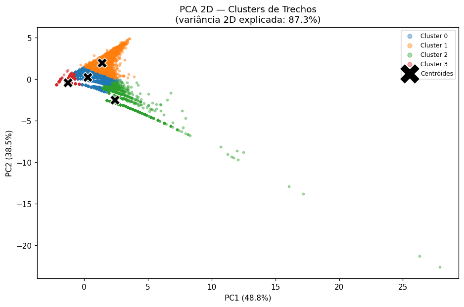
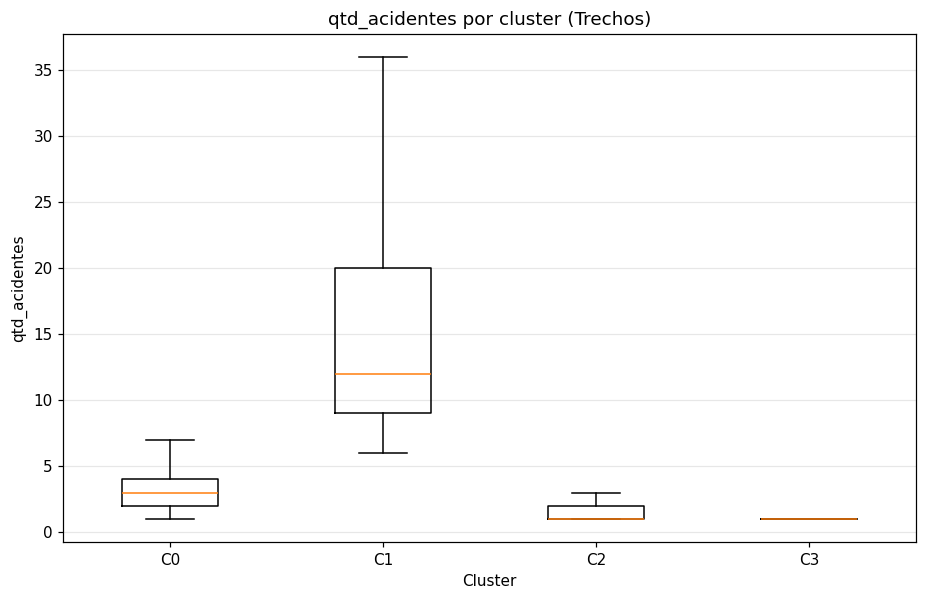
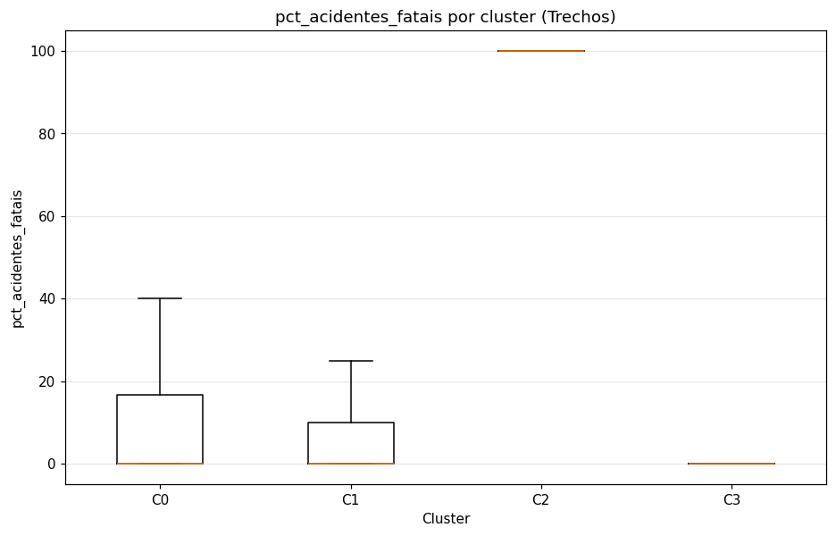
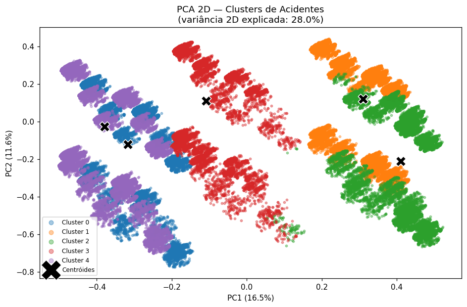
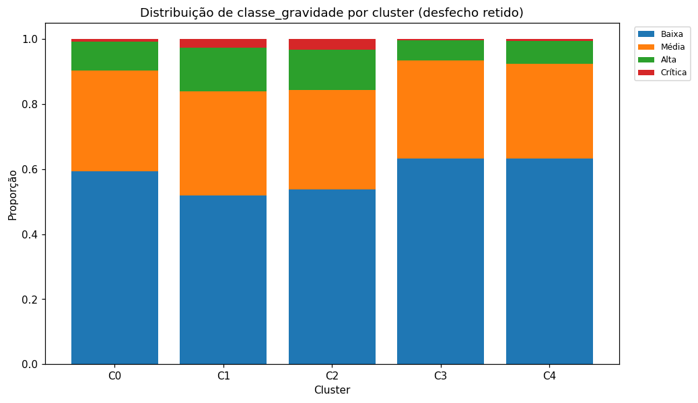
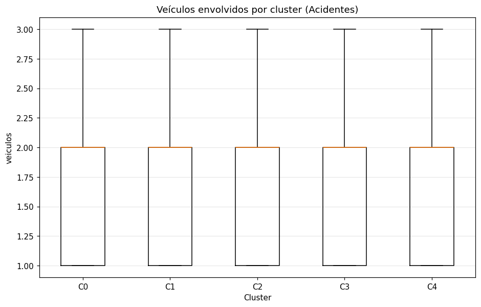
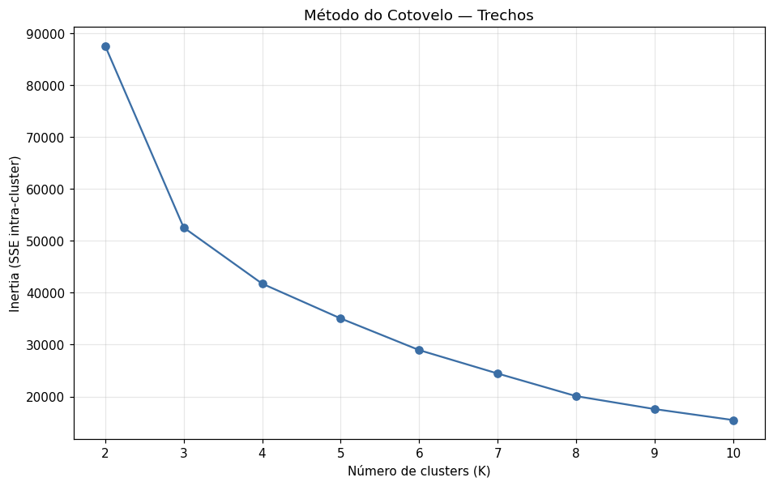
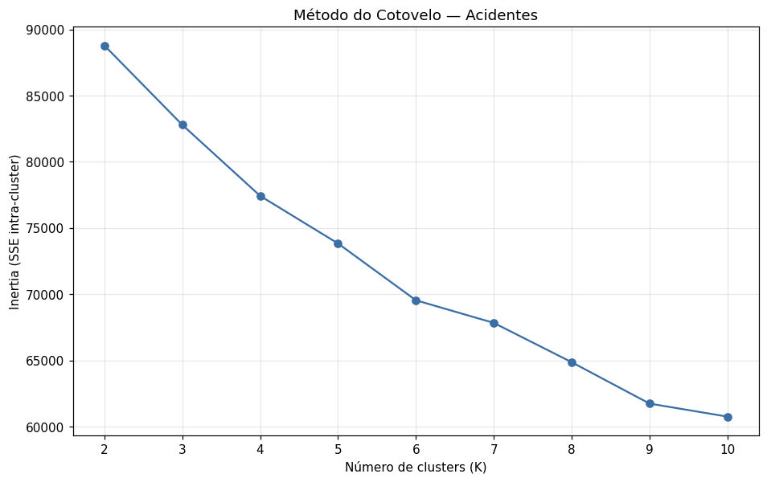
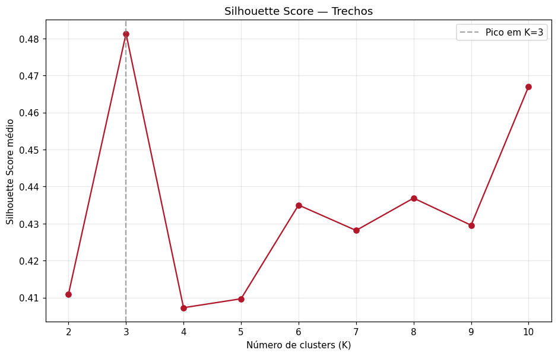
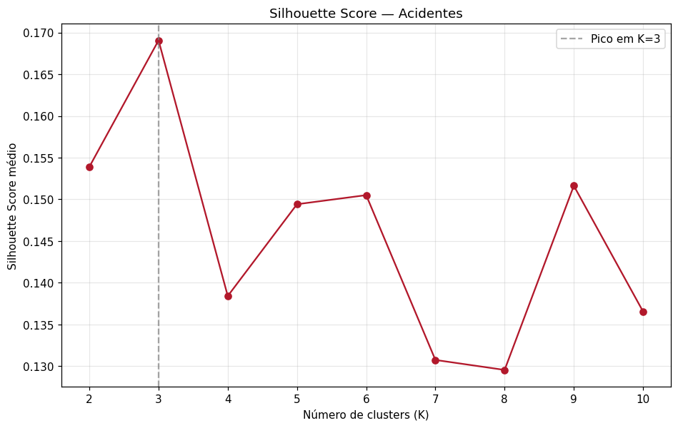

# Relatório — Clusterização (Aprendizado Não Supervisionado)

Etapa de descoberta de **perfis naturais** (não rankings) na malha rodoviária federal,
em dois níveis independentes: trechos rodoviários e acidentes. Base para a etapa de ML
supervisionado e para as recomendações de priorização de investimentos.

## 1. Clusterização dos Trechos

**Dataset:** `data/analytics/trechos_analytics.parquet` (33,024 trechos).
**Features de formação:** `qtd_acidentes`, `indice_gravidade_total`, `indice_gravidade_medio`, `pct_acidentes_fatais`
(frequência, severidade total, risco médio por evento e letalidade).
**Número de clusters:** **K = 4**.

### Perfil de cada grupo

| Cluster | n | % | Qtd.acid (méd) | Índ.médio | % fatais | Mortos (tot) | Fer.graves (tot) |
|---|---|---|---|---|---|---|---|
| 0 | 12179 | 36.88 | 3.42 | 5.90 | 9.23 | 3899 | 14905 |
| 1 | 4696 | 14.22 | 17.62 | 4.21 | 5.65 | 3894 | 20343 |
| 2 | 2941 | 8.91 | 1.41 | 18.49 | 87.77 | 4410 | 2703 |
| 3 | 13208 | 40.00 | 1.30 | 2.59 | 0.00 | 0 | 2411 |

> Médias/medianas das features de formação e o **desfecho retido** (`mortos`,
> `feridos_graves`, `indice_gravidade_maximo`) — este último usado apenas para
> caracterizar os grupos, não para formá-los.

### Interpretação dos perfis

- **Cluster 0 — Médio volume · Médio letalidade**: 12179 trechos (36.9%); média 3.4 acidentes/trecho, índice médio 5.9 (médio risco por evento), 9.2% de acidentes fatais; 3899 mortos e 14905 feridos graves no total.
- **Cluster 1 — Alto volume · Médio letalidade**: 4696 trechos (14.2%); média 17.6 acidentes/trecho, índice médio 4.2 (médio risco por evento), 5.7% de acidentes fatais; 3894 mortos e 20343 feridos graves no total.
- **Cluster 2 — Baixo volume · Alto letalidade**: 2941 trechos (8.9%); média 1.4 acidentes/trecho, índice médio 18.5 (alto risco por evento), 87.8% de acidentes fatais; 4410 mortos e 2703 feridos graves no total.
- **Cluster 3 — Baixo volume · Baixo letalidade**: 13208 trechos (40.0%); média 1.3 acidentes/trecho, índice médio 2.6 (baixo risco por evento), 0.0% de acidentes fatais; 0 mortos e 2411 feridos graves no total.

*Projeção PCA (somente visualização): 87.3% da variância em 2D.*

### Sensibilidade (redundância qtd ↔ índice total, r≈0,89)

Repetindo a clusterização sem `indice_gravidade_total` (3 features), o Silhouette em
K=4 passou de 0.4073 (4 features) para
0.5247 (3 features) — documentado para transparência da
decisão de manter as 4 features pedidas no enunciado.

## 2. Clusterização dos Acidentes

**Dataset:** `data/analytics/acidentes_analytics.parquet` (145,685 acidentes).
**Matriz:** 25 colunas em blocos ponderados — temporal (3), operacional (1), via (4), meteorologia (4), causa (8), tracado (5).
Somente variáveis conhecidas no momento do acidente (sem vazamento de desfecho).
**Número de clusters:** **K = 5**.

### Perfil de cada grupo

| Cluster | n | % | Hora típ. | % FDS | Turno | Pista | Índ.méd | % fatal |
|---|---|---|---|---|---|---|---|---|
| 0 | 18895 | 12.97 | 15.80 | 100.00 | Tarde | Dupla | 3.88 | 5.39 |
| 1 | 50443 | 34.62 | 15.60 | 33.20 | Noite | Simples | 5.19 | 10.03 |
| 2 | 19673 | 13.50 | 14.20 | 35.60 | Tarde | Simples | 5.25 | 9.52 |
| 3 | 14057 | 9.65 | 14.10 | 26.70 | Manhã | Múltipla | 3.54 | 3.99 |
| 4 | 42617 | 29.25 | 13.60 | 0.00 | Manhã | Dupla | 3.66 | 4.51 |

> `ig_media` e `% fatal` são o **desfecho retido**: descrevem a associação
> contexto → severidade observada em cada grupo, sem terem sido usados na formação.

### Interpretação dos perfis

- **Cluster 0 — Tarde · pista Dupla · médio gravidade**: 18895 acidentes (13.0%); hora típica ~16h, 100% no fim de semana, 46% em área urbana; causa predominante 'Ausência de reação do condutor', tempo 'Céu Claro', média de 1.8 veículos; desfecho: índice médio 3.9, 5.4% fatais, 0.058 mortos/acidente.
- **Cluster 1 — Noite · pista Simples · alto gravidade**: 50443 acidentes (34.6%); hora típica ~16h, 33% no fim de semana, 36% em área urbana; causa predominante 'Acessar a via sem observar a presença dos outros veículos', tempo 'Céu Claro', média de 2.1 veículos; desfecho: índice médio 5.2, 10.0% fatais, 0.121 mortos/acidente.
- **Cluster 2 — Tarde · pista Simples · alto gravidade**: 19673 acidentes (13.5%); hora típica ~14h, 36% no fim de semana, 19% em área urbana; causa predominante 'Reação tardia ou ineficiente do condutor', tempo 'Céu Claro', média de 2.0 veículos; desfecho: índice médio 5.2, 9.5% fatais, 0.118 mortos/acidente.
- **Cluster 3 — Manhã · pista Múltipla · baixo gravidade**: 14057 acidentes (9.7%); hora típica ~14h, 27% no fim de semana, 75% em área urbana; causa predominante 'Reação tardia ou ineficiente do condutor', tempo 'Céu Claro', média de 2.0 veículos; desfecho: índice médio 3.5, 4.0% fatais, 0.043 mortos/acidente.
- **Cluster 4 — Manhã · pista Dupla · baixo gravidade**: 42617 acidentes (29.2%); hora típica ~14h, 0% no fim de semana, 50% em área urbana; causa predominante 'Ausência de reação do condutor', tempo 'Céu Claro', média de 2.0 veículos; desfecho: índice médio 3.7, 4.5% fatais, 0.049 mortos/acidente.

*Projeção PCA (somente visualização): 28.0% da variância em 2D — baixa,
como esperado em dados majoritariamente one-hot; clusters sobrepostos na tela podem
estar separados no espaço completo.*

## 3. Método do Cotovelo

A inertia (SSE intra-cluster) cai monotonicamente com K; busca-se o ponto de inflexão
a partir do qual o ganho marginal diminui.

### Trechos

| K | Inertia (SSE) | Silhouette |
|---|---|---|
| 2 | 87,557 | 0.4110 |
| 3 | 52,556 | 0.4813 |
| 4 | 41,744 | 0.4073 |
| 5 | 35,048 | 0.4097 |
| 6 | 28,951 | 0.4350 |
| 7 | 24,438 | 0.4282 |
| 8 | 20,080 | 0.4369 |
| 9 | 17,587 | 0.4296 |
| 10 | 15,472 | 0.4670 |

Inflexão na região de K=3–4; escolhido **K=4**.

### Acidentes

| K | Inertia (SSE) | Silhouette |
|---|---|---|
| 2 | 88,781 | 0.1539 |
| 3 | 82,787 | 0.1691 |
| 4 | 77,421 | 0.1384 |
| 5 | 73,826 | 0.1494 |
| 6 | 69,535 | 0.1505 |
| 7 | 67,826 | 0.1307 |
| 8 | 64,857 | 0.1295 |
| 9 | 61,731 | 0.1516 |
| 10 | 60,747 | 0.1366 |

Curva suave (típico de dados mistos one-hot); inflexão difusa na região de K=4–6,
escolhido **K=5**.

## 4. Silhouette Score

Mede coesão × separação (−1 a 1). Calculado sobre amostra fixa de
10,000 (trechos) e 10,000 (acidentes)
pontos — a métrica é O(n²) e inviável nas bases completas.

**Comparação com o cotovelo:** o silhouette tende a favorecer K menores (grupos mais
separados), enquanto o cotovelo admite K maiores. A escolha final concilia ambos com a
**interpretabilidade** — o menor K cujos perfis contam uma história distinta e nomeável.
Trechos: K=4. Acidentes: K=5.

## 5. Principais Descobertas

**Perfis de trechos encontrados.** A malha se separa essencialmente em dois eixos —
*volume/exposição* (qtd de acidentes, índice total) e *letalidade por evento* (índice
médio, % fatal). Surgem perfis como alto-volume/baixa-letalidade (corredores movimentados),
baixo-volume/alta-letalidade (trechos pontuais porém letais) e grupos intermediários.
O grupo mais crítico em letalidade é o **Cluster 2**
(87.8% de acidentes fatais em média).

**Perfis de acidentes encontrados.** Os grupos combinam janela temporal (hora circular,
fim de semana), tipo de pista, uso do solo, causa predominante e meteorologia. O grupo
de maior severidade observada (desfecho retido) é o **Cluster 2**
(índice médio 5.2, 9.5% fatais).

**Existem grupos claramente mais críticos?** Sim — em ambos os níveis há grupos
destacados: trechos de alta letalidade e contextos de acidente associados a desfechos
mais graves. Isso é associação contexto→severidade, **não relação causal**.

**Como orientar recomendações de investimento.** Os trechos de alta letalidade (mesmo
com baixo volume) sugerem intervenções de engenharia/sinalização pontuais de alto retorno
em vidas; os de alto volume sugerem fiscalização e capacidade. Os perfis de acidentes
indicam quando/onde concentrar fiscalização e campanhas (turno, fim de semana, causa,
condição da via) — a ser quantificado na etapa seguinte de ML supervisionado.

## 6. Metodologia e Limitações

**Pré-processamento.**
- *Trechos:* `log1p` em `qtd_acidentes` e `indice_gravidade_total` (cauda longa);
  `indice_gravidade_medio` e `pct_acidentes_fatais` mantidos (skew baixo / massa em 0);
  `StandardScaler` nas 4. Decisão do usuário: severidade agregada é **descritor de
  perfil do trecho**, não desfecho a prever — por isso entra na formação.
- *Acidentes:* `hora` em sin/cos cíclico; `veiculos` em `log1p`+MinMax; categóricas em
  one-hot com colapso de níveis raros (meteorologia → 4; causa → top-8 + Outros);
  flags `tem_*` mantidas só com prevalência ≥ ~3%. One-hot/booleanos **não** são
  padronizados (z-score explodiria dummies raras); peso de bloco (÷√nº de colunas)
  equilibra a contribuição de cada grupo conceitual.
- *Vazamento:* nenhuma variável de desfecho entra na matriz de acidentes (assert no
  pré-processamento); `indice_gravidade`, `fatal`, `classe_gravidade`, `mortos`, etc.
  são usados apenas para caracterizar os grupos.

**Limitações.** O KMeans assume geometria euclidiana e clusters convexos/isotrópicos,
o que é apenas aproximado em dados mistos com muitos one-hot (distância euclidiana em
colunas 0/1 ≈ Hamming escalado). Alternativas mais adequadas — **K-prototypes** (nativo
para misto), **Gower + Agglomerative/HDBSCAN** — ficam para iterações futuras (custo
O(n²) exige amostragem em 145k linhas). A arquitetura já isola a troca de algoritmo em
`cluster.fit_cluster(X, algo, k)`. Interpretações são associativas, não causais.
