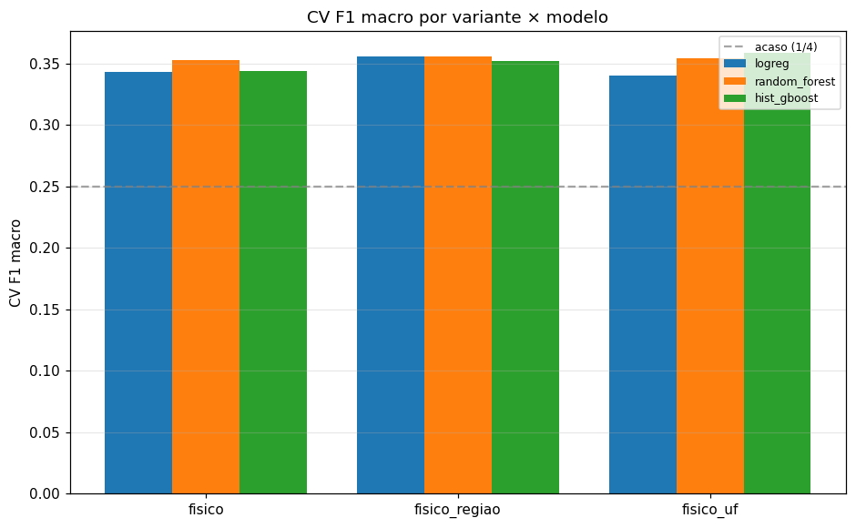
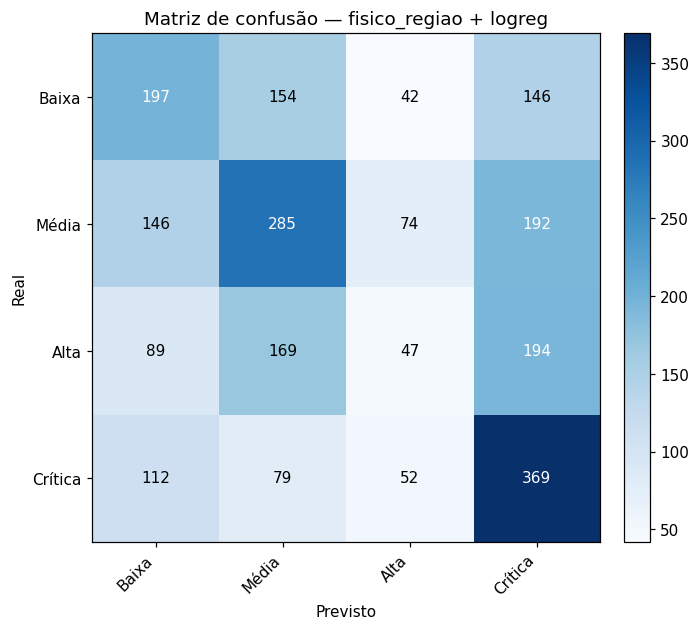
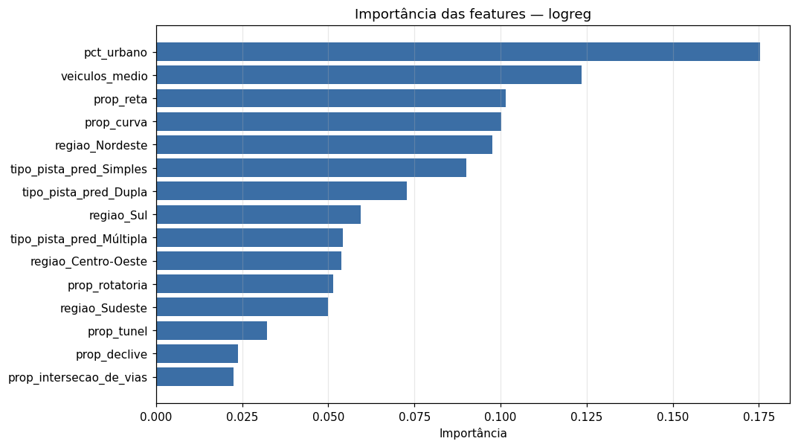

# Relatório — ML Supervisionado (classificação de risco de trechos) — bônus

**Etapa bônus / exploratória** — complementa a entrega central (clusterização de trechos).
Classifica trechos rodoviários em níveis de risco (Baixa/Média/Alta/Crítica) a partir de
**características estruturais** do segmento, sem vazamento de desfecho e sem
identificadores — para subsidiar a priorização de investimentos e generalizar a outras vias.

> As métricas modestas indicam que a estrutura da via explica apenas **parte** do risco:
> uma **predição mais precisa provavelmente exige fatores adicionais** ausentes da base,
> sobretudo **velocidade/limite da via**, volume de tráfego, geometria fina e fiscalização.

## 1. Definição do alvo

Classificação **ordinal** do risco do trecho em 4 níveis
(Baixa < Média < Alta < Crítica), discretizando `indice_gravidade_medio` (severidade
média por acidente). Foram usados apenas trechos com **≥ 3 acidentes**
(o índice médio é instável com 1–2 ocorrências).

**Estratégia de corte:** quantil (quartis do índice médio → 4 faixas de prioridade ~25%).
**Limites aplicados** (`indice_gravidade_medio`): [2.79, 4.0, 5.5].

> A estratégia A (cortes do `classe_gravidade`: 2/8/20) foi testada primeiro, mas produziu
> um alvo **degenerado** — "Crítica" ≈ 0,5% e "Média" ≈ 77% — abaixo do piso de
> 2%. Migramos para **cortes por quantil**, que preservam os
> 4 níveis com classes balanceadas e aprendíveis (decisão documentada no plano).

### Distribuição das classes

| Classe | n | % |
|---|---|---|
| Baixa | 3,410 | 25.04% |
| Média | 4,172 | 30.63% |
| Alta | 2,677 | 19.66% |
| Crítica | 3,360 | 24.67% |

## 2. Features — estruturais, sem vazamento, sem identificador

O modelo aprende com **características do trecho**, não com sua localização — para
generalizar a outras vias. Três variantes são comparadas: **fisico** (V1),
**fisico_regiao** (V2) e **fisico_uf** (V3).

- **Permitidas:** tipo de pista predominante, proporção de traçado (reta/curva/declive/aclive/interseção/ponte/túnel/rotatória), % urbano, média de veículos; + `região` (V2) ou `UF` (V3).
- **Proibidas (guarda anti-vazamento):** todo desfecho (`indice_gravidade*`, `mortos`,
  `feridos_*`, `fatal`, `classe_gravidade`, `qtd_acidentes*`, `pct_acidentes_fatais`) e
  identificadores (`br`, `km_faixa`, `km`, `trecho`). Um `assert` em `features.py` falha se
  qualquer uma entrar na matriz.

As features são agregadas por trecho do nível-acidente (reuso do padrão de
`agregar_por_trecho`).

## 3. Resultados (variante × modelo)

Validação **por grupo (rodovia/BR)**: holdout e CV usam `StratifiedGroupKFold`
(5 folds) com as BRs **disjuntas** — mede a generalização a vias **não
vistas** (o objetivo do modelo), evitando o otimismo de um split aleatório que memoriza
trechos da mesma rodovia. Hiperparâmetros ajustados por `RandomizedSearchCV`
(15 amostragens); modelos com `class_weight="balanced"` num `Pipeline`
com `StandardScaler`.

| Variante | Modelo | nfeat | CV F1 macro | Teste F1 macro | Bal. acc | QWK | Bin F1 | Bin recall | Bin AUC |
|---|---|---|---|---|---|---|---|---|---|
| fisico_uf | hist_gboost | 40 | 0.359 | 0.369 | 0.376 | 0.238 | 0.612 | 0.675 | 0.645 |
| fisico_regiao **(entrega)** | logreg | 18 | 0.356 | 0.349 | 0.368 | 0.258 | 0.595 | 0.596 | 0.652 |
| fisico_regiao | random_forest | 18 | 0.356 | 0.343 | 0.364 | 0.237 | 0.599 | 0.626 | 0.647 |
| fisico_uf | random_forest | 40 | 0.355 | 0.350 | 0.362 | 0.223 | 0.603 | 0.655 | 0.635 |
| fisico | random_forest | 13 | 0.353 | 0.348 | 0.362 | 0.216 | 0.614 | 0.681 | 0.637 |
| fisico_regiao | hist_gboost | 18 | 0.352 | 0.365 | 0.376 | 0.235 | 0.594 | 0.615 | 0.647 |
| fisico | hist_gboost | 13 | 0.344 | 0.345 | 0.365 | 0.224 | 0.613 | 0.677 | 0.644 |
| fisico | logreg | 13 | 0.343 | 0.328 | 0.357 | 0.235 | 0.630 | 0.699 | 0.649 |
| fisico_uf | logreg | 40 | 0.340 | 0.359 | 0.369 | 0.260 | 0.599 | 0.626 | 0.650 |

**Modelo de entrega** (melhor algoritmo na variante transferível recomendada):
`fisico_regiao` + `logreg` — CV F1 macro
0.356, teste F1 macro 0.349, QWK 0.258,
e visão binária (Alta∪Crítica) AUC 0.652 / recall 0.596.

> **Transferibilidade × desempenho.** Há um gradiente claro: `fisico` < `fisico_regiao` <
> `fisico_uf` — adicionar localização ajuda. Mas o ganho da **UF** sobre a **região** é
> pequeno (AUC 0.679 vs 0.669; CV F1 0.363 vs 0.360) e vem em boa parte de *decorar* estados
> específicos (dummies `uf_*` entre as features mais fortes), o que **não generaliza** a vias
> novas. A variante **`fisico_regiao`** captura quase todo o sinal regional com 18 features
> (vs 40) e **preserva a transferência** — sendo a escolha recomendada como modelo de
> entrega, alinhada ao objetivo de aplicar o modelo a outras vias. O modelo só-físico
> (`fisico`) é o mais transferível de todos, ao custo de ~0,02 de AUC.

## 4. Interpretação

Features mais influentes (melhor modelo):

- `pct_urbano`: 0.175
- `veiculos_medio`: 0.123
- `prop_reta`: 0.102
- `prop_curva`: 0.100
- `regiao_Nordeste`: 0.098
- `tipo_pista_pred_Simples`: 0.090
- `tipo_pista_pred_Dupla`: 0.073
- `regiao_Sul`: 0.060

A leitura é **associativa, não causal**. Entre as features físicas, pesam o **tipo de
pista** (Múltipla), o **uso do solo** (`pct_urbano`) e a **geometria do traçado**
(rotatória, curva, reta) — coerente com a EDA Analytics, que já associava pista e traçado
à severidade. Não se afirma direção causal: são padrões de coincidência.

## 5. Limitações e plano B

- **Teto de desempenho modesto** (F1 macro ≈ 0.35 em 4 classes; acaso =
  0,25). Esperado: a estrutura da via explica **parte** do risco — comportamento,
  velocidade, fiscalização e aleatoriedade (ausentes nas features) dominam o restante.
  Isso é o esperado de um modelo **sem vazamento**: métricas honestas, não infladas por
  decorar localizações. A visão binária (AUC ≈ 0.65) é útil para triagem.
- **Cortes do alvo são fronteiras** sobre um contínuo ruidoso; a estratégia por quantil
  torna "Crítica" = "top ~25% mais severos", não um extremo absoluto.
- **Cobertura:** o filtro ≥ 3 acidentes exclui trechos esparsos
  (alvo ruidoso); o modelo se aplica a trechos com algum histórico ou a vias novas cujas
  características físicas sejam conhecidas.
- **Para uma predição mais precisa, faltam fatores:** o teto é limitado pelos dados. Ganhos
  reais viriam de variáveis ausentes que dirigem o risco — sobretudo **velocidade/limite da
  via**, volume de tráfego (VMD), geometria fina (raio de curva, rampa), fiscalização/radares
  e iluminação.
- **Plano B (regressão):** prever `indice_gravidade_medio` contínuo (R²/MAE) e mapear para
  os 4 níveis na apresentação evita o problema de classe rara; fica como próximo passo se
  for preciso priorizar a leitura contínua de risco.
