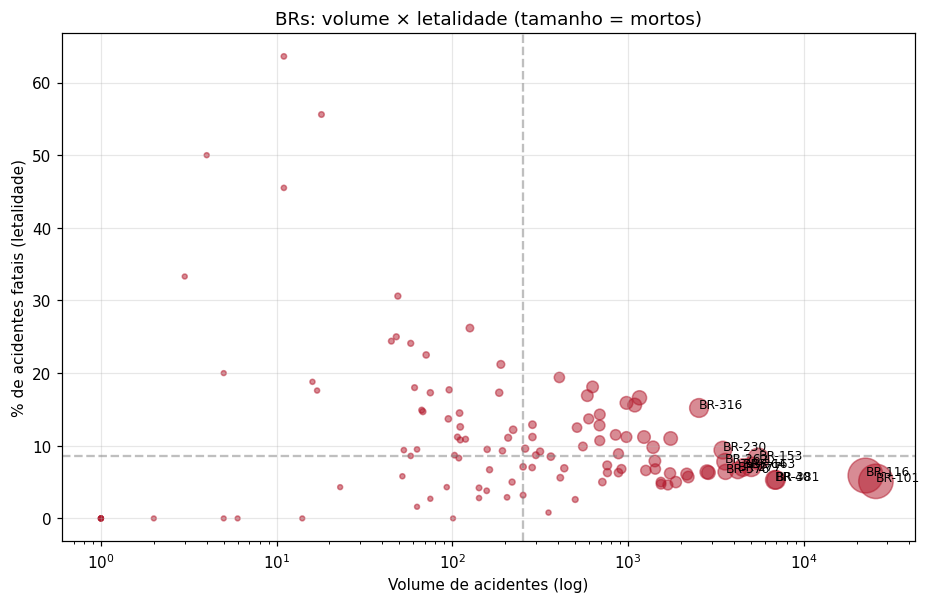
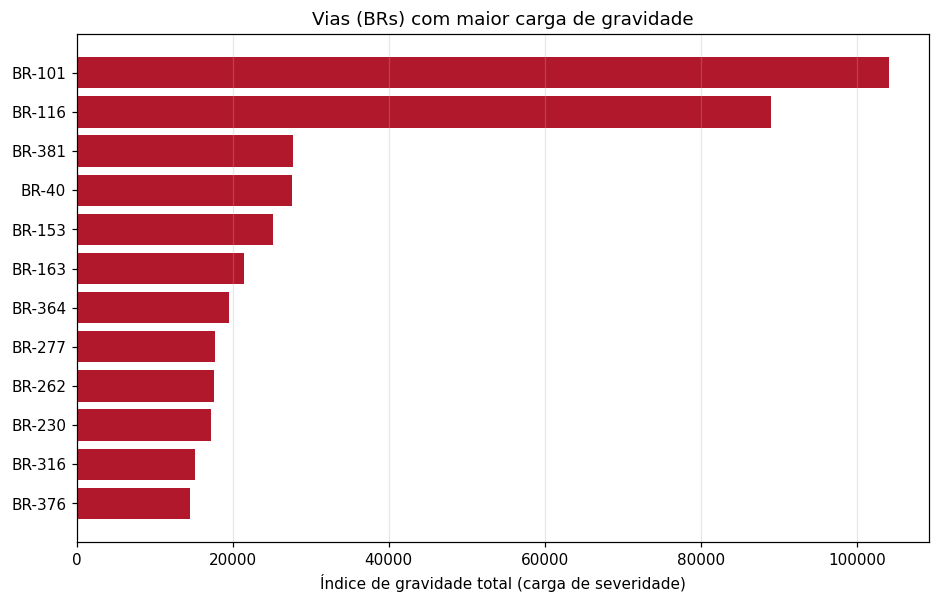

# Relatório Final — Priorização de Investimentos (Acidentes PRF)

Síntese das etapas do projeto (EDA → Feature Engineering → Clusterização → ML) aplicada ao
objetivo central: **onde investir e o quê fazer** para reduzir mortes e feridos na malha
rodoviária federal. Base: 2024–2025. Leituras são **associativas, não causais**.

## 1. Dois eixos de risco (não confundir volume com letalidade)

O projeto mostrou que **volume ≠ gravidade**: há corredores que concentram muitos acidentes
(carga total) e há trechos raros porém **altamente letais**. A priorização trata os dois.
A clusterização isolou um grupo crítico — **8.9% dos trechos concentram
4,410 mortos** (36% do total), com baixíssimo
volume e altíssima letalidade.

## 2. Vias (BRs) prioritárias

### 2a. Maior carga de gravidade (corredores de alto volume)

| BR | Acid. | Mortos | Índ.total | % fatal | % simples | % noturno |
|---|---|---|---|---|---|---|
| 101 | 25792 | 1492 | 104098 | 5 | 29 | 42 |
| 116 | 22499 | 1529 | 88974 | 6 | 35 | 45 |
| 381 | 6965 | 408 | 27722 | 5 | 20 | 41 |
| 40 | 6861 | 419 | 27576 | 5 | 31 | 41 |
| 153 | 5527 | 552 | 25104 | 8 | 60 | 46 |
| 163 | 5035 | 450 | 21474 | 7 | 70 | 47 |
| 364 | 4520 | 367 | 19516 | 7 | 57 | 45 |
| 277 | 4218 | 316 | 17688 | 7 | 41 | 48 |
| 262 | 3572 | 321 | 17620 | 8 | 71 | 44 |
| 230 | 3469 | 367 | 17192 | 9 | 49 | 46 |
| 316 | 2538 | 422 | 15090 | 15 | 69 | 51 |
| 376 | 3593 | 261 | 14552 | 6 | 20 | 44 |

**BR-101 e BR-116** dominam a carga absoluta (~1.500 mortos cada) — corredores longos,
urbanizados e movimentados. Prioridade de **capacidade, fiscalização e gestão de tráfego**.

### 2b. Maior letalidade (rodovias de pista simples, alto risco por acidente)

| BR | Acid. | Mortos | % fatal | % simples | % noturno |
|---|---|---|---|---|---|
| 222 | 1163 | 228 | 17 | 70 | 49 |
| 135 | 1093 | 210 | 16 | 49 | 41 |
| 316 | 2538 | 422 | 15 | 69 | 51 |
| 365 | 1234 | 174 | 11 | 68 | 46 |
| 232 | 1750 | 205 | 11 | 41 | 46 |
| 158 | 1391 | 165 | 10 | 85 | 47 |
| 230 | 3469 | 367 | 9 | 49 | 46 |
| 153 | 5527 | 552 | 8 | 60 | 46 |

Rodovias como **BR-316, BR-153, BR-262, BR-163** combinam **alta % de pista simples** e
**alta letalidade** — perfil clássico de colisão frontal. Prioridade de **duplicação,
barreira central e iluminação**.

## 3. Trechos críticos

### 3a. Hotspots de carga (maior índice de gravidade total)

| Trecho | Acid. | Mortos | Índ.tot | Pista | % urb | Intervenção sugerida |
|---|---|---|---|---|---|---|
| MG_116_286 | 9 | 38 | 526 | Simples | 11 | Duplicação + barreira central; Iluminação |
| SC_101_206 | 155 | 1 | 524 | Múltipla | 85 | Gestão de tráfego urbano |
| SC_101_207 | 153 | 1 | 490 | Múltipla | 82 | Gestão de tráfego urbano |
| PE_101_69 | 109 | 3 | 458 | Dupla | 79 | Gestão de tráfego urbano |
| SC_101_205 | 136 | 5 | 430 | Múltipla | 85 | Gestão de tráfego urbano |
| SC_101_204 | 137 | 1 | 428 | Múltipla | 84 | Gestão de tráfego urbano |
| ES_101_270 | 117 | 2 | 426 | Dupla | 87 | Gestão de tráfego urbano |
| SP_116_219 | 140 | 3 | 408 | Múltipla | 84 | Gestão de tráfego urbano |
| PE_101_70 | 95 | 4 | 384 | Dupla | 78 | Gestão de tráfego urbano |
| SP_116_222 | 99 | 2 | 378 | Múltipla | 84 | Gestão de tráfego urbano |
| SP_116_228 | 106 | 8 | 374 | Múltipla | 84 | Gestão de tráfego urbano |
| SC_101_210 | 104 | 2 | 370 | Múltipla | 88 | Iluminação; Gestão de tráfego urbano |
| SC_101_208 | 116 | 0 | 360 | Múltipla | 86 | Gestão de tráfego urbano |
| RJ_40_121 | 94 | 6 | 352 | Múltipla | 80 | Gestão de tráfego urbano |
| SP_116_227 | 113 | 6 | 352 | Múltipla | 88 | Gestão de tráfego urbano |

### 3b. Trechos mais letais (≥ 5 acidentes, maior % fatal)

| Trecho | Acid. | Mortos | % fatal | Pista | Causa | Intervenção sugerida |
|---|---|---|---|---|---|---|
| PE_232_212 | 6 | 4 | 67 | Simples | Acesso irregular | Duplicação + barreira central; Iluminação |
| PR_153_121 | 8 | 5 | 63 | Simples | Velocidade Incompatível | Duplicação + barreira central; Iluminação; Geometria/sinalização + redutores; Radar + fai… |
| MG_251_427 | 10 | 7 | 60 | Simples | Velocidade Incompatível | Duplicação + barreira central; Geometria/sinalização + redutores; Radar + faixa de ultrap… |
| PR_277_160 | 5 | 6 | 60 | Simples | Acumulo de água sobre o pavimento | Duplicação + barreira central; Geometria/sinalização + redutores; Drenagem + recuperação … |
| MA_316_609 | 5 | 5 | 60 | Simples | Ausência de reação do condutor | Duplicação + barreira central; Geometria/sinalização + redutores |
| BA_101_690 | 5 | 4 | 60 | Simples | Demais falhas mecânicas ou elétricas | Duplicação + barreira central; Iluminação; Geometria/sinalização + redutores |
| MA_316_597 | 5 | 4 | 60 | Simples | Ausência de reação do condutor | Duplicação + barreira central; Iluminação |
| PR_373_280 | 5 | 4 | 60 | Simples | Acessar a via sem observar a presença dos outros veículos | Duplicação + barreira central; Iluminação; Geometria/sinalização + redutores |
| PE_232_93 | 5 | 3 | 60 | Dupla | Ingestão de álcool pelo condutor | Iluminação; Blitz de alcoolemia |
| GO_414_387 | 5 | 3 | 60 | Simples | Velocidade Incompatível | Duplicação + barreira central; Geometria/sinalização + redutores; Radar + faixa de ultrap… |
| AL_101_208 | 5 | 3 | 60 | Simples | Ausência de reação do condutor | Duplicação + barreira central; Geometria/sinalização + redutores |
| MA_316_611 | 5 | 3 | 60 | Simples | Transitar na contramão | Duplicação + barreira central; Iluminação |
| AL_101_174 | 5 | 3 | 60 | Dupla | Ausência de reação do condutor | Gestão de tráfego urbano |
| CE_222_301 | 7 | 4 | 57 | Simples | Ausência de reação do condutor | Duplicação + barreira central; Iluminação; Geometria/sinalização + redutores |
| BA_242_323 | 7 | 4 | 57 | Simples | Reação tardia ou ineficiente do condutor | Duplicação + barreira central; Geometria/sinalização + redutores |

## 4. Da evidência à proposta — matriz de intervenção

As intervenções acima são atribuídas por regras sobre o **perfil observado** de cada trecho:

| Evidência no trecho | Intervenção proposta |
|---|---|
| Pista simples + alta letalidade / contramão / ultrapassagem | **Duplicação / faixa adicional + barreira central** |
| Alta % de acidentes noturnos ou atropelamentos | **Iluminação** |
| Alta % em curva/declive | **Melhoria geométrica + sinalização/redutores** |
| Causa velocidade incompatível / ultrapassagem | **Fiscalização eletrônica (radar) + faixa de ultrapassagem** |
| Causa ingestão de álcool | **Blitz de alcoolemia** |
| Pedestre / trecho urbano | **Passarelas/travessias iluminadas + gestão de tráfego** |
| Causa chuva / acúmulo de água / pavimento | **Drenagem + recuperação do pavimento** |

## 5. Recomendação (resumo executivo)

1. **Corredores de alto volume (BR-101, BR-116):** gestão de tráfego, fiscalização de
   velocidade/distância e melhorias de capacidade nos hotspots urbanos (SC, SP, PE).
2. **Rodovias de pista simples e alta letalidade (BR-316, BR-153, BR-262, BR-163):**
   programa de **duplicação + barreira central + iluminação** — maior retorno em vidas.
3. **Trechos pontuais extremamente letais:** intervenções dirigidas pelo perfil (geometria
   em curvas/declives, radares onde a causa é velocidade, travessias onde há pedestres,
   drenagem onde há acúmulo de água).

## 6. Ressalvas

- Métricas por trecho são ruidosas em baixo volume; o índice depende dos pesos (12/6/2).
- Sem dados de **volume de tráfego (VMD)** e **velocidade da via**, a normalização por
  exposição e a priorização fina ficam limitadas — principal lacuna para trabalhos futuros.
- As recomendações apoiam a decisão; não substituem vistoria de engenharia de campo.
